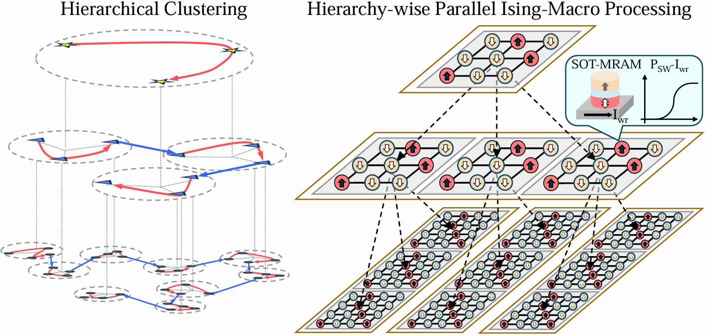

# TAXI: Traveling Salesman Problem Accelerator with X-bar-based Ising Macros Powered by SOT-MRAMs and Hierarchical Clustering

This repository is the space to design a Traveling Salesman Problem (TSP) Accelerator with X-bar-based Ising Macros for large-scale TSPs. The backbone of this repository is [Neuro-Ising](https://github.com/souravsanyal06/Neuro-Ising).



In "TAXI.ipynb", a TSPlib specified is clustered by agglomeration clustering, then solved depending on the type of Ising-Solver configured by "MAC_ising" from the higher-level clusters to the lower-level clusters. Available Ising solvers are presented below:
1. ising_MAC is a c++ program coded by "Ising_Layer_MAC". It is based on Ising Macros with SOT-MRAM stochastic switching characteristics.
2. ising_RNG is a c++ program coded by "Ising_Layer-RNG". It solves the TSPs by generating random numbers by CMOS-based RNG and flipping random spins.

In the paper, "ising_MAC" is simulated at the circuit level for latency and energy consumption based on TSMC 65nm technology and the SOT-MRAM Verilog-A model.

## Citation

If you find TAXI useful for your work, please cite the following source:
```
@article{yoo2025TAXI,
        title   =  {TAXI: Traveling Salesman Problem Accelerator with X-bar-based Ising Macros Powered by SOT-MRAMs and Hierarchical Clustering},
        author  =  {Yoo, Sangmin and Holla, Amod and Sanyal, Sourav and Kim, Dong Eun
                    and Iacopi, Francesca and Biswas, Dwaipayan and Myers, James and Roy, Kaushik},
        journal = {Proceedings of the 62nd ACM/IEEE Design Automation Conference (DAC)},
        number  = {60},
        pages   = {1-7},
        year    = {2025}
}
```

## Acknowledgement

TAXI was initially developed by Sangmin Yoo (joint affiliation in IMEC USA and NRL of Purdue University).

Additional contributions were made by Amond Holla and Sourav Sanyal.

This work was funded through the joint MOU between the Indiana Economic Development Corporation, Purdue University, imec with in-kind support from the Applied Research Institute.
